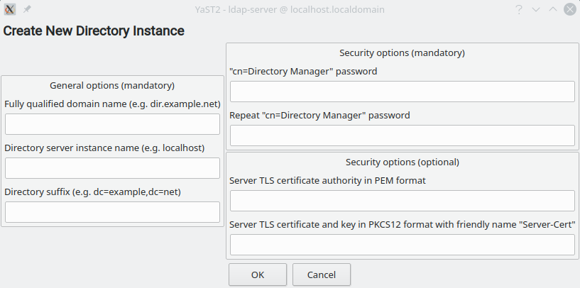
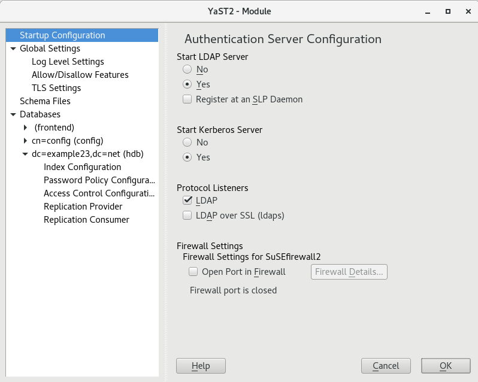
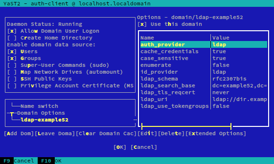

# Authentication-related YaST modules and yast2-users

This document describes the relationship between the current yast2-users module and the different
modules in the YaST scope used to configure the authentication of the system. Note most of those
other modules are developed and maintained by the Samba Team at SUSE while the yast2-users module
itself is under the responsibility of the YaST Team at SUSE.

## The yast2-users package

As explained in the [detailed document](./use-cases-old-modules.md), the YaST Users module can be
used to:

 * List, add, modify and delete local users and groups stored in the traditional Unix files
   `/etc/passwd`, `/etc/groups`, etc.
 * List users and groups from the NIS databases known to the system, with the possibility of
   defining additional membership to groups.
 * List, add, modify and delete users and groups from an LDAP directory. The settings to access
   the LDAP server are read from `/etc/openldap/ldap.conf`.

The yast2-users package also offers a plugins system that allows to define properties for each
type of user and group. Each plugin can then define how those properties are represented in the user
interface and how they are stored in the system.

The package yast2-users itself offers the following plugins to configure LDAP users and groups:

 * LDAPAll: allows to manage the value of several attributes of the LDAP object representing a
   given user (eg. *departmentOf*, *description*, *gecos*, *jpegPhoto*) or group (eg.
   *businessCategory*, *description*, *memberOf*, *owner*).
 * Kerberos: makes it possible to add, delete and edit Kerberos principals associated to a user.
 * LDAPShadowAccount: enables to edit the following attributes of the LDAP object representing
   a given user - *shadowInactive*, *shadowExpire*, *shadowLastChange*, *shadowMin*, *shadowMax*,
   *shadowWarning* and *shadowFlag*.
 * LDAPPasswordPolicy: allows to define the password policy applied to a user and the value of the
   corresponding *pwdAccountLockedTime* attribute.

Additionally, the following plugin is available for local users:

 * Quota: allows to define the hard and soft quotas for the user or group on each of the
   file-systems configured to support traditional Unix quotas.

## The yast-auth-server package

The yast2-auth-server package offers two clients that act as wizards to create new instances of an
LDAP or Kerberos server respectively. In that regard, they are different from a typical YaST module
to configure servers. The YaST clients provided by this package never inspect the current state of
the system and they do not display the configuration of the existing server instances. And, as an
obvious consequence, they do not provide any way to change such current configurations. They always
start from scratch (with a blank configuration) and create a new instance of the service.

There is no connection between yast2-auth-server and yast2-users:

 * none of the packages rely on the functionality provided by the other
 * yast2-auth-server does not take care of updating the configuration files used by yast2-users to
   find the LDAP server

That used to be different with old versions of yast2-auth-server (previous to the rewrite done for
Leap 15.0 and SLE-15). Instead of the current wizards to create new instances, those versions used
to provide a YaST client that displayed the current configuration of the LDAP and Kerberos server
making it possible to add, edit or remove databases.

When creating a new database, that old interface provided a checkbox to configure the LDAP clients
and, as a side effect, yast2-users. Quoting the corresponding help text (unlike current versions,
the old interface used to have a "Help" button): "_To use this database as default for the OpenLDAP
client tools (e.g. ldapsearch), check **Use this database as the default for OpenLDAP clients**.
This will result in the hostname 'localhost' and the above entered **Base DN** being written to the
OpenLDAP client configuration file `/etc/openldap/ldap.conf`. This checkbox is selected by default
when creating the first database on a server._".

As mentioned above, that integration between the configuration of the LDAP server and the settings
used by yast2-users to connect to the LDAP directory is currently lost.

## The yast2-auth-client package

The package offers two main clients that allow to configure the access to remote identity and
authentication systems.

 * auth-client: offers a general SSSD configuration.
 * ldapkrb: specific UI for configuring just LDAP and Kerberos.

Again, the approach of the user interface of those clients is quite different from the usual YaST
modules. Both start with a read-only table that summarizes some information about the system (such
as "Computer Name" or "IP Addresses") and a button "Change Settings" that can be used to open the
real configuration dialog. Unlike regular YaST configuration dialogs, these clients do not include
any "Help" button and several of the screens do not fit into a text-mode screen with 80 columns and
24 lines.

The module allows to configure single or multi-domain authentication via SSSD. The system can be
configured to use any of the following sources to authenticate and to get the corresponding entities
(such as users or groups):

 * FreeIPA
 * LDAP
 * Local SSSD file database
 * MS Active Directory
 * Delegate to proxy_lib_name
 * Kerberos (authentication only, not getting entities)

Regarding entities, the system can be configured to read the following types: users, groups, 
sudo data, autofs, SSH public keys and MS-PAC (a concept associated to MS Active Directory).

When the client "auth-client" is used to perform the configuration, the settings to use in order to
connect to the LDAP server are written to the corresponding section of `/etc/sssd/sssd.conf`. When
the "ldapkrb" client is used, those settings are written to `/etc/ldap.conf`. Note that none of
those match the location used by yast2-users (`/etc/openldap/ldap.conf`).

In general, there is no connection between yast2-auth-client and yast2-users:

 * none of the packages rely on the functionality provided by the other
 * yast2-users does not honor all the possible LDAP configurations written by yast2-auth-client
 * yast2-auth-client does not take care of updating the configuration files used by yast2-users to
   find the LDAP server

## The package yast2-samba-server

This package allows to configure the system as a Samba server. The entities of the domain like users
and groups can be stored in an LDAP directory or locally in the Samba server using TDB databases (a
simple file-based backend used for small Samba deployments). Bear in mind that each computer in a
Samba domain is represented by a user in a special group usually called "machines".

The yast2-samba-server package does no depend on the functionality provided by yast2-users to
perform its basic duties, since it does not offer any interface to manage users or groups. But there
are some connections between both modules.

The most important is that yast2-samba-server provides two plugins for yast2-users (unsurprisingly
called Samba and SambaGroups) to configure the Samba-related attributes of the LDAP users and
groups.

In addition, yast2-samba-server provides the script `data/add_machine.rb` as a helper to add the
corresponding user to the LDAP database when a new machine joins the Samba domain. That script
relies on a call to `YaPI::USERS.UserAdd`.

## Other YaST packages

There are other YaST packages that can be used to configure system authentication, both in the
client and in the server side. But none of them are actually connected to yast2-users, and very
likely that should stay that way.

 * yast2-nis-server: allows to export the local users of the machine via NIS. That doesn't change
   how users are managed, so it has no impact in yast2-users or the other way around.
 * yast2-nis-client: allows to configure the machine to read users from a remote NIS server.
   Obviously, if the system is configured to do so (using this YaST package or manually) yast2-users
   will offer the possibility of listing the NIS users. But yast2-nis-client does nothing specific
   to yast2-users and the latter needs nothing from any NIS-related YaST package (yast2-users just
   checks whether a NIS client is running by its own means).
 * yast2-samba-client: allows the system to authenticate against an existing Samba domain. No impact
   in user management.
